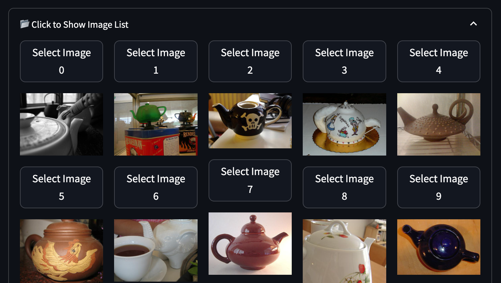

# BA Kaidashova Concept-based Contrastive Explanation

This repository explores **concept-based contrastive explanations** and the impact of the **concept relevance** on the explanatiom length. 

## **Installation Setup**

To set up the environment:

1. Create a Conda environment using the provided `environment.yml`:
   ```bash
   conda env create -f environment.yml
    ```
2. Install Concept-relevance propagation

    ```bash
    pip install ./zennit-crp
    ```
## Dataset

To load the dataset, run the `download_script.py` to download the train, test, and validation images of two classes. Then, organize the images into the correspondong train/test/val folder.

## Model

To fine-tune the VGG16 model with batch normalization, use the `train_test_model.py` script.

## Embeddings

To generate embeddings, execute the `embeddings.py` script.

## Concept Analysis

Run the concept analysis with the `analyse_features` script.
This step is essential for extracting concepts using the Zennit-CRP approach.

## Dashboard

Once the previous steps are completed, start the Streamlit dashboard with the following command:
```bash
streamlit run App/index.py
```

## User Path
1. 


## Repository structure

- `App`: Contains the Streamlit dashboard.
- `concept-length`: Files with the length of concept-based contrastive explanations.
- `concept-length_augm`: Files with the length of concept-based contrastive explanations for augmented images.
- `embeddings`: Folder for storing embeddings.
- `zennit-crp`: Modified version of the Zennit-CRP repository ([original here](https://github.com/rachtibat/zennit-crp)).
- `analyse_features.py`: Script for performing Zennit-CRP concept analysis.
- `concept_func.py`: Helper functions for concept processing.
- `download_script.py`: Script for downloading the dataset.
- `embeddings.py`: Script for generating embeddings.
- `eval_test.py`: Evaluation script using ANOVA to compare explanation length based on concept relevance (very strong, strong, low, very low).
- `eval_test_augm.py`: Evaluation script using paired t-test to compare explanation lengths between normal and augmented image explanations.
- `evaluation.py`: Script for calculating explanation length.
- `evaluation_augm.py`: Script for calculating explanation length for augmented images.
- `model_freezed`: Contains model structure and training/testing functions.
- `train_test_model.py`: Script for model training and fine-tuning.


